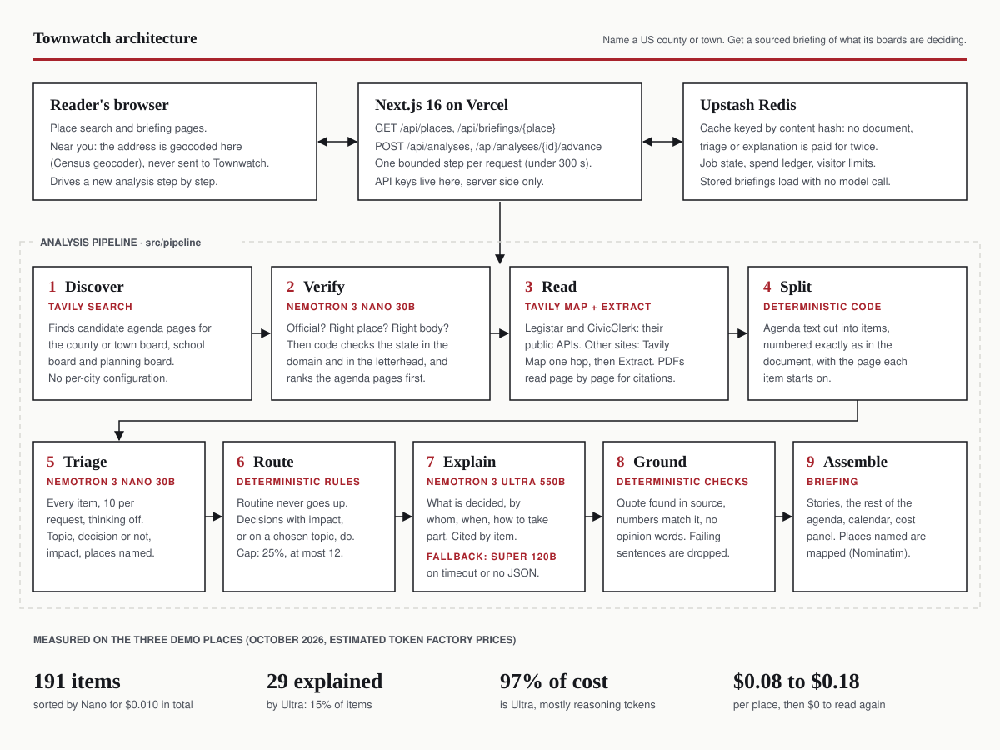

# Townwatch

**What your county, town and school board are deciding, explained in plain English from their own agendas.**

Live: **https://townwatch-tau.vercel.app**

Medill's State of Local News 2025 data lists 213 US counties with no local news source at all. In those places, nobody reads the county commission agenda for residents. The agendas are public, but they are long PDFs scattered across county sites, school district portals and agenda platforms.

Townwatch takes the name of a US county or town and, with no per-city setup:

1. finds the official agenda pages of its main boards (county or town board, school board, planning board),
2. reads every agenda item of the current period,
3. sorts all of them with a small Nemotron model and sends only the decisions that matter to Nemotron 3 Ultra,
4. publishes **This week in [Town]**: a short, neutral briefing where every sentence links to the agenda item (and page) it comes from.

It also gives a meeting calendar, a **Near you** section that ranks items by distance from the reader's address (computed in the browser, never sent to the server), and a **How this was made** panel with every model call, token and cent spent on that place.

## Try it

| Place | Why it is here | Briefing |
|---|---|---|
| Edgecombe County, NC | News desert (Medill 2025). County site plus a school district PDF portal. | [/nc-edgecombe-county](https://townwatch-tau.vercel.app/nc-edgecombe-county) |
| Columbia County, GA | Read through the CivicClerk public API. | [/ga-columbia-county](https://townwatch-tau.vercel.app/ga-columbia-county) |
| Ann Arbor, MI | For comparison: its county has 12 local news sources. City on Legistar, county on CivicClerk. | [/mi-ann-arbor](https://townwatch-tau.vercel.app/mi-ann-arbor) |

These three load from the stored briefing, at no cost. Any other US county or town can be analysed from the home page; a new place takes a few minutes (limits below).

## How it works



| Stage | What runs | Notes |
|---|---|---|
| 1. Discover | Tavily Search | Queries name the place, the state and the body ("board of commissioners", "fiscal court" in Kentucky, "quorum court" in Arkansas, "police jury" in Louisiana). If the main body is not found, a second search is scoped to the county's own domain. |
| 2. Verify | Nemotron 3 Nano 30B, then code | The model answers: official site? right place? right body? Then deterministic checks reject other states (state names and codes in the domain, the state in the document letterhead) and neighbouring counties, and rank real agenda pages above "meet the board" pages. |
| 3. Read | Legistar and CivicClerk public APIs, Tavily Map and Extract, unpdf | JavaScript portals are read through platform readers written once per platform. Other sites go through Tavily Map (one hop, with instructions) and Extract. PDFs are read page by page so citations carry page numbers; Extract is the fallback when a site blocks direct downloads. |
| 4. Split | Code | Agenda text is cut into items numbered exactly as in the document (4.8, 8.1.2, VI.A...). |
| 5. Triage | Nemotron 3 Nano 30B | Every item, 10 per request, thinking off: topic, decision or information, impact on residents, places named. |
| 6. Route | Code | Routine items never escalate. Decisions with medium or high impact, or on a topic the reader chose, do. At most 25% of items and 12 per place. |
| 7. Explain | Nemotron 3 Ultra 550B, fallback Super 120B | What is decided, by whom, when, what changes, how to take part. Each statement carries a short quote from the item. |
| 8. Ground | Code | A statement is kept only if its quote is found in the source text, every number in it appears in the source, and it uses no opinion words. Otherwise it is dropped and counted in the panel. |
| 9. Assemble | Code, Nominatim | Stories, the rest of the agenda as written, calendar, cost panel. Places named in items are geocoded for Near you. |

An analysis is a persisted job advanced in bounded steps (`POST /api/analyses/{id}/advance`), so no request runs longer than one stage, and two visitors asking for the same place share one job. Every document, triage batch and explanation is cached under a hash of its content: nothing is paid for twice, and a place already analysed loads without any model call.

## Nemotron on Nebius Token Factory

All model calls go through the Token Factory OpenAI-compatible API (`src/lib/models.ts`). The cascade is the point: a small model looks at everything, the large model only at what matters.

| Model (catalogue id) | Role | Settings | Calls | Tokens in | Tokens out (of which reasoning) | Cost |
|---|---|---|---|---|---|---|
| `nvidia/NVIDIA-Nemotron-3-Nano-30B-A3B` | Verify sources, triage every item | thinking off, JSON, 60 s timeout | 47 | 56,574 | 25,946 (0) | $0.010 |
| `nvidia/Nemotron-3-Ultra-550b-a55b` | Explain escalated decisions | reasoning on, JSON, 150 s timeout | 44 | 28,766 | 124,027 (106,352) | $0.401 |
| `nvidia/nemotron-3-super-120b-a12b` | Fallback when Ultra times out or returns no JSON | thinking off | 2 | 1,557 | 1,051 (0) | $0.001 |
| **Total, three demo places** | | | **93** | | | **$0.41** |

Measured on the three demo briefings in October 2026 (191 agenda items, 29 explained). Costs use estimated per token prices, since the official price list needs a login. Per place: $0.076 (Edgecombe), $0.176 (Columbia), $0.160 (Ann Arbor).

What the numbers say:

- **Nano sorts 191 items for one cent.** Ultra costs 97% of the bill, and 86% of Ultra's output is reasoning. The routing rule, not the prompt, is what keeps a place under 20 cents.
- **Nano beat Lightning for triage.** On 70 hand-labelled Edgecombe items, Lightning 3.5 was three times faster (13 s against 42 s) at the same cost and the same recall (0.73), but its escalation precision was 0.44 against 0.80 for Nano. In a cascade, the small model's precision sets the large model's bill. Details in `research/triage-eval.json`.
- **Geography belongs in code.** Nano accepted same-named places in other states (a Cumberland County, NC site for Cumberland County, VA). Domain and letterhead checks now run after the model.
- **Ultra can reason until `max_tokens` and return nothing usable.** That reply is treated like a timeout and the item goes to Super.

The full list of what was hard is in [FRICTION_LOG.md](FRICTION_LOG.md).

## Tavily

Tavily is called at run time for every new place (`src/lib/tavily.ts`):

- **Search** finds the candidate agenda pages, with a second pass scoped by `include_domains` to the county's official domain.
- **Map** follows one hop from a board page to the page that actually lists agendas, guided by instructions.
- **Extract** reads HTML agenda listings and agenda pages, and fetches PDFs from sites that refuse direct downloads.
- Credits are counted with `include_usage` and shown in each place's panel: 7, 9 and 10 credits for the three demo places.

## Nebius

Every inference call runs on Nebius Token Factory. A nightly refresh of followed places as a Nebius Serverless Job is specified (user story 6 in the spec) but not built yet.

## Trust rules

- Every sentence cites its source document and agenda item, with the page when the document has pages. No source, no sentence.
- Strictly neutral wording; an opinion word list is enforced in code.
- A missing date, amount or place reads "not stated in the record", never a guess.
- Every page says the official record prevails, and every line links to it.
- Real places and real documents only. There is no sample data in the product.

## Privacy

The reader's address is geocoded in the browser by the US Census geocoder and compared with item locations in the browser. It is never sent to Townwatch. Townwatch has no accounts, no tracking cookies and no analytics. To enforce the daily limit it stores a salted hash of the visitor's IP address; the salt changes every day and the counters expire, so the address itself is never stored. See [/privacy](https://townwatch-tau.vercel.app/privacy).

## Limits, measured honestly

- **New places:** one per visitor per day, ten per day overall, and analysis stops if recorded model spend reaches 12 USD.
- **Zero-configuration discovery works on 4 of 11 news-desert counties** sampled from the Medill list (`research/sc004.md`). Each success was checked by hand against the county's real site. The failures are mostly counties that publish no agenda online, publish agendas as news posts, or use content systems whose agenda pages are rendered by JavaScript. A live test on Hood River County, OR found the right sites but could not read a dated agenda from them.
- **BoardDocs** (used by many school districts) is not read yet, so Ann Arbor's school board falls back to the county intermediate school district.
- Some county sites refuse visitors from outside the US: from France, the whole Edgecombe County site answers 403, so its citation links only open from a US connection.
- Token prices are estimates until the official price list is public.

## Run it locally

Requires Node 24.

```bash
npm install
cp .env.example .env.local   # then add NEBIUS_API_KEY and TAVILY_API_KEY
npm test                     # 111 unit and pipeline tests, no network
npm run dev
```

Without Upstash credentials the app stores everything in `.cache/kv` on disk. Run the pipeline for one place from the command line:

```bash
npm run pipeline -- all --place nc-edgecombe-county
```

Running it twice costs nothing the second time. The pipeline test replays a recorded run of Edgecombe County (`tests/fixtures/recorded/`), so the whole chain is tested offline. Browser tests (27, including an axe WCAG 2.1 AA audit in light and dark mode, keyboard and mobile checks): `npx playwright install chromium` then `npx playwright test`, or `E2E_BASE_URL=https://townwatch-tau.vercel.app npx playwright test` to run them against production.

Before any deploy, `npm run check:secrets` searches the code and the client bundle for API keys.

## Repository

```
src/pipeline/   discover, verify, read, split, triage, route, explain, ground, assemble
src/pipeline/readers/   Legistar, CivicClerk and generic agenda readers
src/lib/        models (Token Factory client), Tavily client, store, limits, place index
src/app/        Next.js pages and API routes
src/client/     in-browser geocoding and distance ranking (Near you)
specs/001-civic-briefing/   spec, plan, research, data model, contracts, tasks (Spec Kit)
research/       triage evaluation, discovery measurements
```

Built with Next.js 16, TypeScript, zod, Upstash Redis, MapLibre with OpenFreeMap tiles, and the US Census Gazetteer for the place index.

## License

MIT. See [LICENSE](LICENSE).
